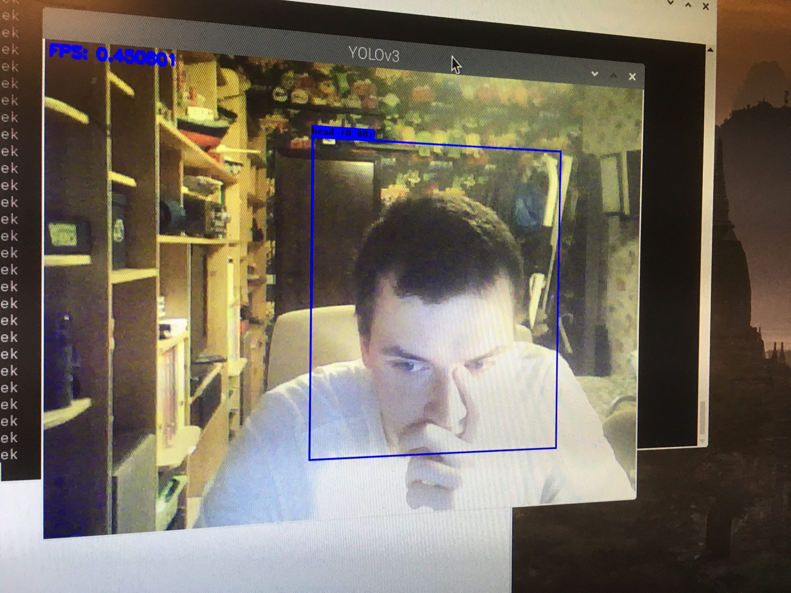

# Smart-camera project


Данные репозиторий содержит код для запуска системы умная камера.

В данной работе описан процесс создания прототипа системы «Умная камера» на Raspberry Pi 3. Для анализа требований потенциальных пользователей системы было использовано глубинное интервью с владельцами среднего и малого бизнеса. Результат опроса показал, что наиболее интересной функцией для потенциальных пользователей является определение интенсивности посетителей, вследствие чего была поставлена задача определения количества людей на изображении. Для решения данной задачи использовалась модель YOLO Tiny версии 3, обученная на наборе данных SCUT-HEAD и реализованная на фреймфорке машинного обучения Tensorflow и Tensorflow Lite. Скорость распознавания с изображения для модели Tensorflow составила 2 секунды, для Tensorflow Lite – 1 секунду.

Ключевые слова: smart cameras, object detection, image segmentation, image processing, software prototyping, prototypes, data visualization, monitoring, Raspberry Pi 3, IOT.

Данная работа была написана совместно при участии Баранов А., Бутенко В., Головачев И., Юдина Т., Якименко М. При использовании материалов ссылка на авторов проекта обязательна.

Текст работы: https://github.com/yudinatatiana/Smart-camera-Raspberry-Pi-3


Для запуска системы с полной версией модели необходимо запустить 

```
python3 scripts/detection.py —path_weights ./model_data/tiny-yolo_weights_full.h5 —path_anchors ./model_data/tiny-yolo_anchors.csv —path_classes ./train_classes.txt —path_output ./results —path_video 0
```


Для запуска модели с версией Tensorflow Lite необходимо запустить след. код:
```
python3 tf_lite_run.py
```

Пример работы алгоритма на большой аудитории

